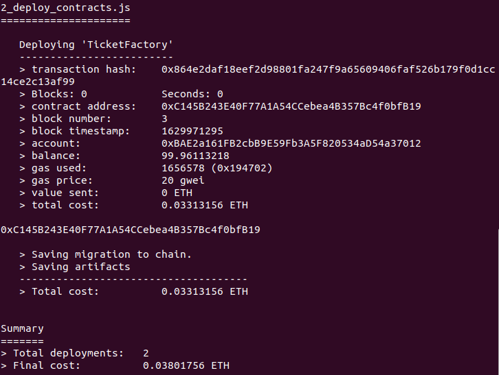

# Blockchain JO 2024

This school project is the blockchain part of a ticket manager for JO 2024.
There is a bonus web application to show how to call your blockchain contract.

It's a good minimalist example of what can be done with solidity and web3js.

## Prerequisites

First you need to have some packages installed:

- npm (needed for solidity dependencies)

- yarn (optional if you want to use yarn instead of npm to install packages of app)

- expo (needed to launch the app)

## Blockchain packages installation

### Ganache (development)

Ganache is needed to create a private blockchain.
It allows you to deploy your contracts in a local environment.

Install it :

```bash
npm install ganache ganache-cli ganache-core --global
```

### Truffle

Truffle is needed to build your contracts and deploy them on any blockchain.

Install it :

```bash
npm install truffle --global
```

## Usage

### Private blockchain deployment

First, you need to launch a private blockchain locally.

```bash
ganache-cli
```

something like this is displayed :


:warning: don't stop the command or close this terminal. Open a new one for other commands.

### Contracts build and deployment

Then, you can modify the file `truffle-config.js` with your own configurations.

Deploy your contract :
(You don't need to build your contracts, this command do it for you)

```bash
truffle deploy --network [network_name]
# truffle deploy --network development
```

the `network_name` parameter is the name of your network in the `truffle-config.js`, in the networks section. (for example `development`)

You will get something like that :



:warning: you can see the `contract address`, keep it somewhere.

### Web application deployment

First, you need to get the built contract informations:

```bash
cp build/contracts/TicketFactory.json app/utils/TicketFactory.json
```

Modify the `TicketFactoryAddress` variable in the file `app/App.js`. (this value is the `contract address` given by the truffle command)

Go to app folder and install dependencies

```bash
cd app

expo install
# OR yarn install
# OR npm install
```

Start the application

```bash
expo start
# OR yarn start
# OR npm start
```

You can now go to your application at the url given by expo
